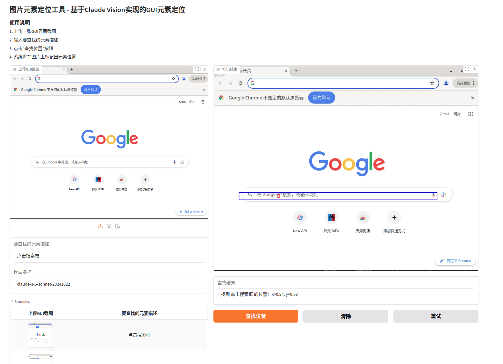

# GUI Element Locator

基于Claude 3.5实现的GUI元素智能定位工具。通过自然语言描述,快速定位界面元素位置。

[English](./README_EN.md) | 简体中文

## 🌟 最新更新

### v1.1.0 (2024-03-25)

#### 新特性
- 🎯 两阶段定位策略
  - 第一阶段：区域定位
  - 第二阶段：精确点位定位
- 🤖 智能元素分类系统
  - 支持10种常见GUI元素类型识别
  - 针对不同元素类型优化定位策略
- 📊 网格辅助系统
  - 添加可视化坐标网格
  - 提供更精确的位置参考
- ✨ 置信度评估系统
  - 自动评估定位结果可信度
  - 低置信度结果提供确认机制

#### 性能优化
- 🚀 改进图像压缩算法
- 🔄 优化API调用策略
- 💾 添加结果缓存机制

#### 用户体验提升
- 🎨 区分注意力区域和目标点的显示
- 📝 更详细的结果反馈
- 🛠️ 完善的错误处理机制

## 🌟 特性

- 🤖 基于Claude-3.5的智能识别
- 🎯 两步定位策略,提供更精确的坐标
- 🌍 支持多语言元素描述
- 📊 可视化结果展示
- 🔄 自动重试和错误处理机制
- 📝 完整的日志记录

## 🚀 快速开始

### 环境要求

- Python 3.8+
- Claude API Key

### 安装

```bash
git clone https://github.com/xiaoqidaov2/GUI_Element_Locator.git
cd GUI_Element_Locator
pip install -r requirements.txt
```

### 配置

1. 复制配置模板文件
```bash
cp config.example.py config.py
```

2. 编辑 `config.py`, 设置你的API密钥:
```python
API_KEY = "your_claude_api_key"
```

### 运行

```bash
python app.py
```

访问 `http://localhost:7860` 打开Web界面

## 📖 使用说明

1. 上传GUI界面截图
2. 输入要查找的元素描述
3. 点击"查找位置"
4. 获取标注结果和坐标信息

### 新功能使用说明

#### 元素类型识别
系统现已支持以下GUI元素类型的智能识别：
- 按钮 (button)
- 图标 (icon)
- 输入框 (input)
- 文本 (text)
- 链接 (link)
- 复选框 (checkbox)
- 单选框 (radio)
- 下拉框 (dropdown)
- 菜单 (menu)
- 其他 (other)

#### 置信度评估
- 系统会自动评估定位结果的可信度
- 置信度低于0.4时会提示确认
- 可以选择继续或重新定位

## 🛠️ 技术栈

- Python
- Gradio
- Claude Vision API
- PIL
- Requests

## 📊 示例



输入: "点击搜索框"

## 🔧 高级配置

```python
# 配置最大图片大小
MAX_IMAGE_SIZE_MB = 5

# 配置重试次数
MAX_RETRIES = 3

# 配置重试延迟
RETRY_DELAY = 1
```

## 🤝 贡献指南

1. Fork 本仓库
2. 创建新的分支 `git checkout -b feature/AmazingFeature`
3. 提交更改 `git commit -m 'Add some AmazingFeature'`
4. Push到分支 `git push origin feature/AmazingFeature`
5. 提交Pull Request

## 📄 许可证

该项目采用 MIT 许可证 - 查看 [LICENSE](LICENSE) 文件了解详情

## 🙏 致谢

- [Claude](https://www.anthropic.com/claude)
- [Gradio](https://gradio.app/)


## 🔍 常见问题

### Q: 如何处理大尺寸图片?
A: 系统会自动压缩图片到5MB以下,无需手动处理。

### Q: 支持哪些语言描述?
A: 支持所有主流语言,包括中文、英文等。

## 📈 更新日志

### [1.0.0] - 2024-03-20
- 首次发布
- 支持基础元素定位功能
- 添加Web界面

## 🗺️ 开发路线图

- [ ] 添加批量处理功能
- [ ] 优化定位算法
- [ ] 添加更多示例
- [ ] 支持更多元素类型
```

这个README包含了项目的主要信息、安装说明、使用方法、配置选项等重要内容,采用了清晰的结构和emoji标注,使得内容更加直观。你可以根据实际需求对内容进行调整。
